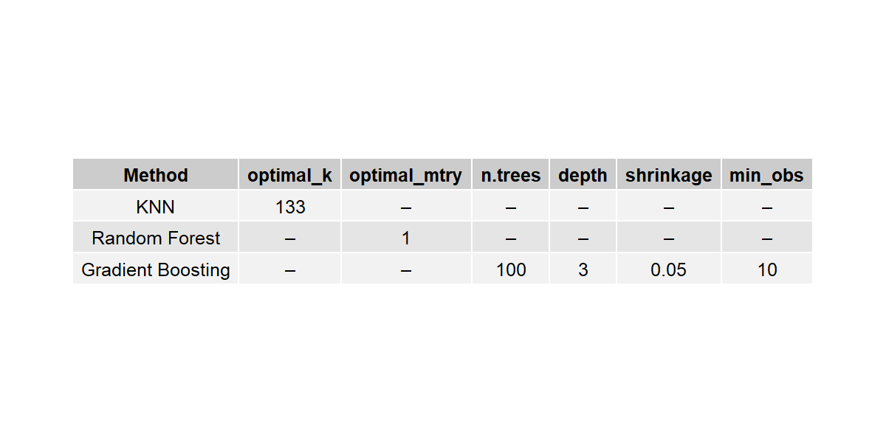
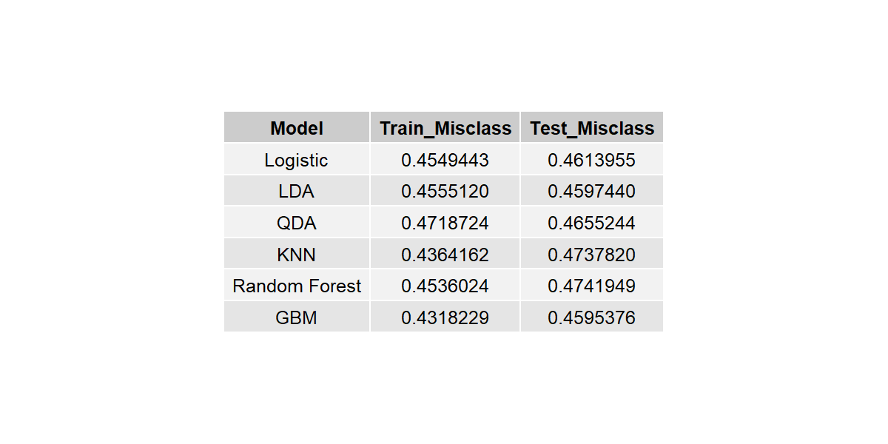
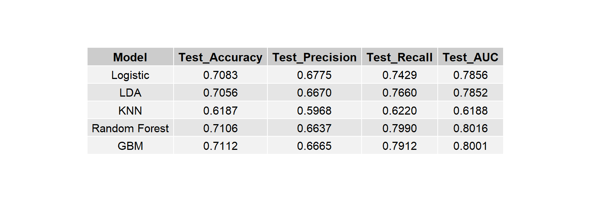
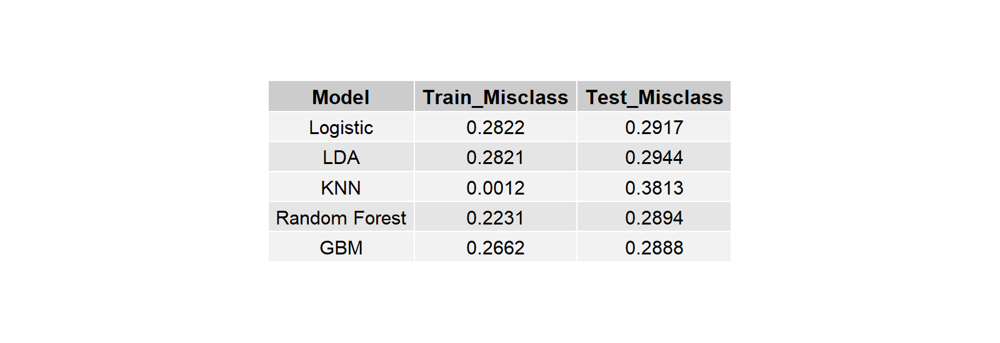
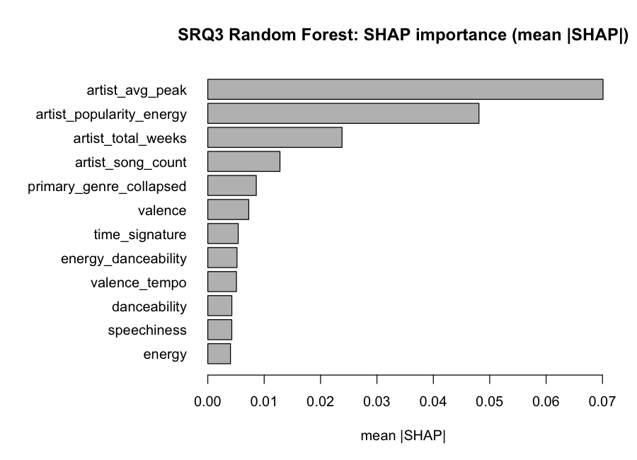
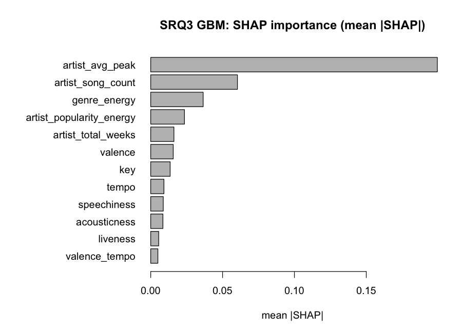
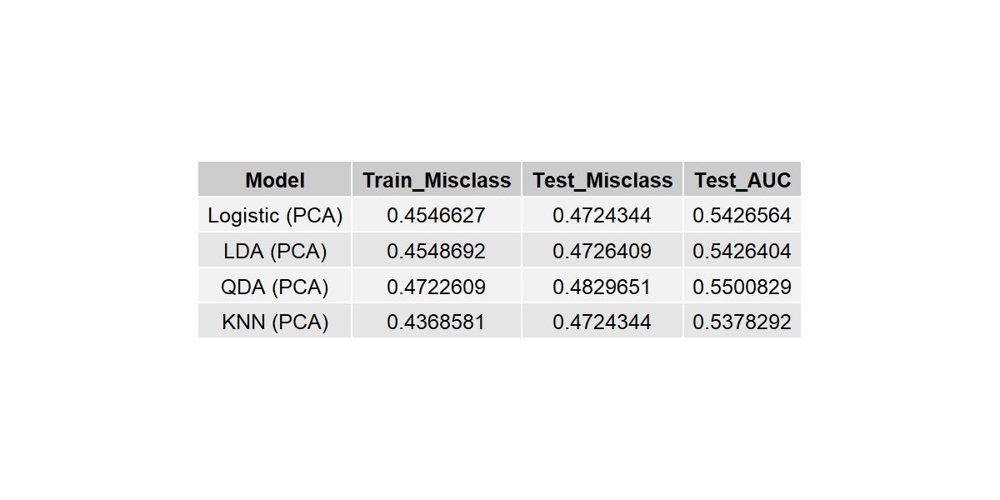

# Billboard Hot 100 Hit Prediction

The project  predicts whether a song becomes a Billboard Hot 100 “hit” using Spotify audio features, artist metadata, and chart history.

## Overview

This project merges two datasets:

- **Billboard Hot 100** weekly chart history (`Hot Stuff.csv`)
- **Spotify audio features** for charted tracks (`Hot 100 Audio Features.csv`)

Songs are labeled as a **hit** (`hit = 1`) if their peak chart position is **≤ 40**; otherwise they are non-hits (`hit = 0`). Several classification models are trained, tuned, and compared across four sub-research questions (SRQ1–SRQ4).

## Project Structure

```
.
├── Code/
│   └── Billboard.R          # Main analysis script (EDA, modeling, evaluation)
├── Data/
│   ├── Hot Stuff.csv        # Billboard Hot 100 weekly chart data
│   └── Hot 100 Audio Features.csv   # Spotify track metadata & audio features
├── Project.Rproj              # RStudio project file
└── README.md
```

## Data

| File | Description |
|------|-------------|
| `Data/Hot Stuff.csv` | Weekly Billboard Hot 100 entries (song, performer, week, position, peak position, etc.) |
| `Data/Hot 100 Audio Features.csv` | Spotify audio descriptors (danceability, energy, valence, tempo, loudness, genre, etc.) |

**Key variables used in modeling:**

- **Response:** `hit` — binary indicator (peak position ≤ 40)
- **Audio features:** danceability, energy, valence, tempo, loudness, acousticness, instrumentalness, speechiness, liveness, duration, key, mode, time signature
- **Extended features (SRQ3):** primary genre, artist song count, artist chart weeks, artist average peak, and interaction terms

## Requirements

### R packages

Install dependencies before running:

```r
install.packages(c(
  "tidyverse", "caret", "ggplot2", "qgraph", "pROC", "broom",
  "gridExtra", "tidyr", "class", "randomForest", "gbm", "MASS",
  "dplyr", "doParallel", "ranger", "fastshap", "pscl", "car"
))
```

## How to Run

1. Open `Project.Rproj` in **RStudio** (or set the working directory to the project root).
2. Ensure the `Data/` folder is present with both CSV files.
3. Run the full pipeline:

```r
source("Code/Billboard.R")
```

> **Note:** Run from the project root so relative paths such as `Data/Hot 100 Audio Features.csv` resolve correctly.

## Analysis Workflow

The script `Code/Billboard.R` implements the following stages:

### SRQ1 — Exploratory Data Analysis

- Merge and clean Billboard + Spotify data at the song level
- Create the binary `hit` outcome
- Boxplots, histograms, summary statistics, and point-biserial correlations
- Logistic regression with scaled audio features (AUC, VIF, coefficient plots)
- Correlation network among audio features (`qgraph_plot.png`)

### SRQ2 — Model Comparison (Audio Features Only)

- 80/20 train/test split with cross-validation tuning
- Models: **Logistic Regression**, **LDA**, **QDA**, **KNN**, **Random Forest**, **Gradient Boosting**
- Hyperparameter tuning for KNN, RF, and GBM
- Train vs. test misclassification summary (`train_test_misclass_summarized.png`, `tuning_results.png`)

### SRQ3 — Extended Features & Interactions

- Adds genre, artist-level statistics, and interaction terms (e.g., energy × danceability, genre × energy)
- Retrains and evaluates Logistic, LDA, KNN, Random Forest, and GBM
- **SHAP** feature importance for Random Forest and GBM (`shap_rf_importance.png`, `shap_gbm_importance.png`)
- Performance tables and paired *t*-tests comparing Random Forest to other models

### SRQ4 — Dimensionality Reduction (PCA)

- PCA on scaled audio features (components explaining ~90% variance)
- Logistic, LDA, QDA, and KNN on principal components
- Misclassification and AUC comparison (`train_test_misclass_srq4.png`)

## Results

### SRQ2 — Hyperparameter tuning (audio features only)

| Method | optimal_k | optimal_mtry | n.trees | depth | shrinkage | min_obs |
|--------|-----------|--------------|---------|-------|-----------|---------|
| KNN | 133 | — | — | — | — | — |
| Random Forest | — | 1 | — | — | — | — |
| Gradient Boosting | — | — | 100 | 3 | 0.05 | 10 |



### SRQ2 — Train vs. test misclassification

| Model | Train Misclass | Test Misclass |
|-------|----------------|---------------|
| Logistic | 0.4549 | 0.4614 |
| LDA | 0.4555 | 0.4597 |
| QDA | 0.4719 | 0.4655 |
| KNN | 0.4364 | 0.4738 |
| Random Forest | 0.4536 | 0.4742 |
| GBM | 0.4318 | 0.4595 |

**Best test misclassification:** GBM (0.4595), followed closely by LDA (0.4597).



### SRQ3 — Extended model test performance

| Model | Test Accuracy | Test Precision | Test Recall | Test AUC |
|-------|---------------|----------------|-------------|----------|
| Logistic | 0.7083 | 0.6775 | 0.7429 | 0.7856 |
| LDA | 0.7056 | 0.6670 | 0.7660 | 0.7852 |
| KNN | 0.6187 | 0.5968 | 0.6220 | 0.6188 |
| Random Forest | 0.7106 | 0.6637 | 0.7990 | **0.8016** |
| GBM | **0.7112** | 0.6665 | 0.7912 | 0.8001 |

**Best overall:** Random Forest achieves the highest test AUC (0.8016); GBM has the highest test accuracy (0.7112).



### SRQ3 — Train vs. test misclassification

| Model | Train Misclass | Test Misclass |
|-------|----------------|---------------|
| Logistic | 0.2822 | 0.2917 |
| LDA | 0.2821 | 0.2944 |
| KNN | 0.0012 | 0.3813 |
| Random Forest | 0.2231 | **0.2894** |
| GBM | 0.2662 | 0.2888 |

KNN shows strong overfitting (train 0.0012 vs. test 0.3813). **Random Forest** and **GBM** have the lowest test misclassification (~0.29).



### SRQ3 — SHAP feature importance

**Random Forest** — top predictors by mean |SHAP|:

| Rank | Feature | mean \|SHAP\| (approx.) |
|------|---------|-------------------------|
| 1 | artist_avg_peak | 0.070 |
| 2 | artist_popularity_energy | 0.048 |
| 3 | artist_total_weeks | 0.024 |
| 4 | artist_song_count | 0.013 |
| 5 | primary_genre_collapsed | 0.009 |

**Gradient Boosting** — top predictors by mean |SHAP|:

| Rank | Feature | mean \|SHAP\| (approx.) |
|------|---------|-------------------------|
| 1 | artist_avg_peak | 0.19 |
| 2 | artist_song_count | 0.06 |
| 3 | genre_energy | 0.035 |
| 4 | artist_popularity_energy | 0.025 |
| 5 | artist_total_weeks | 0.018 |

Artist chart history (`artist_avg_peak`, weeks on chart, song count) dominates both models; raw audio features (energy, danceability, speechiness) contribute less.





### SRQ4 — PCA-based models

| Model | Train Misclass | Test Misclass | Test AUC |
|-------|----------------|---------------|----------|
| Logistic (PCA) | 0.4547 | **0.4724** | 0.5427 |
| LDA (PCA) | 0.4549 | 0.4726 | 0.5426 |
| QDA (PCA) | 0.4723 | 0.4830 | **0.5501** |
| KNN (PCA) | 0.4369 | **0.4724** | 0.5378 |

PCA reduces dimensionality but **test AUC (~0.54)** is much lower than SRQ3 full-feature models (~0.80), suggesting most predictive signal is lost or not captured in the first principal components.



### Key takeaways

1. **Extended features (SRQ3)** outperform audio-only models (SRQ2): test accuracy rises from ~54% to ~71%, and AUC from ~0.54 to ~0.80.
2. **Random Forest and GBM** are the strongest classifiers on the full feature set, with Random Forest edging GBM on AUC.
3. **Artist history** (average peak position, chart weeks, song count) is the strongest predictor of future hit status—not Spotify audio descriptors alone.
4. **PCA (SRQ4)** does not improve discrimination; full engineered features are needed for good performance.

## Generated Outputs

Running the script writes figures and tables to the project root, including:

| Output | Description |
|--------|-------------|
| `qgraph_plot.png` | Audio feature correlation network |
| `tuning_results.png` | Optimal hyperparameters (KNN, RF, GBM) |
| `train_test_misclass_summarized.png` | SRQ2 train/test misclassification rates |
| `shap_importance_plot_srq3_rf.png` | Random Forest SHAP feature importance |
| `shap_importance_plot_srq3_gbm.png` | GBM SHAP feature importance |
| `train_test_performance_srq3.png` | SRQ3 test accuracy, precision, recall, AUC |
| `train_test_errors_srq3.png` | SRQ3 train/test misclassification rates |
| `train_test_misclass_srq4.png` | SRQ4 PCA-based model results |

## Models Used

| Model | Purpose |
|-------|---------|
| Logistic Regression | Interpretable baseline; coefficient inference |
| LDA / QDA | Linear and quadratic discriminant analysis |
| KNN | Non-parametric classifier (with CV-tuned *k*) |
| Random Forest | Ensemble tree model with mtry tuning |
| Gradient Boosting (GBM) | Boosted trees with grid search over depth, shrinkage, and trees |

## License

Academic coursework — for educational use.
